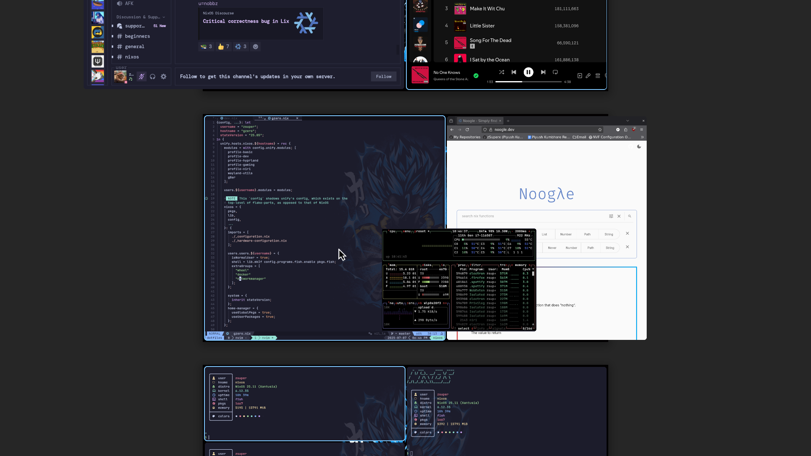
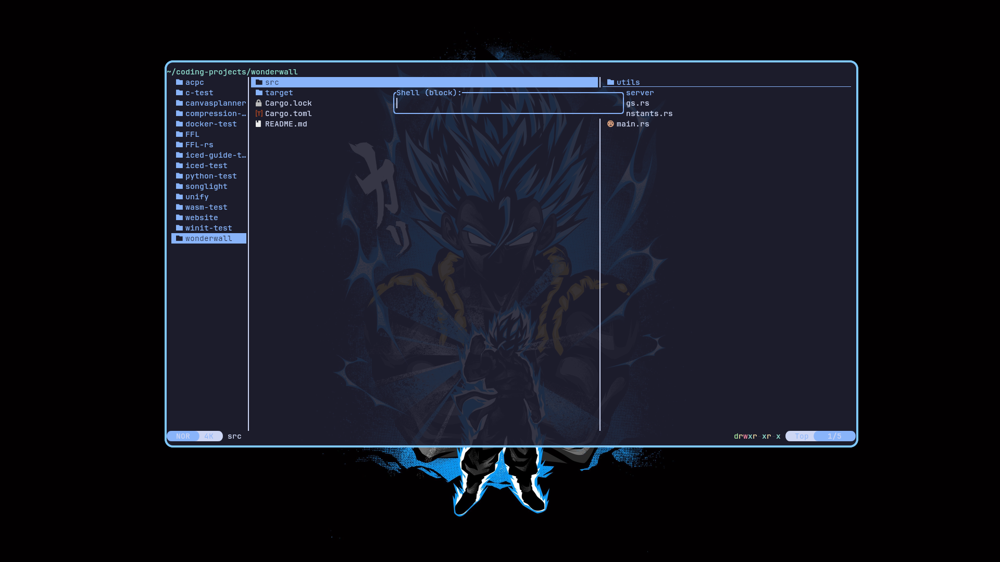

# Dotfiles

This repository contains all scripts, config, and most importantly, `.nix`
files that directly rebuild into my system.

In addition to being managed by Nix, this project attempts to follow the
[Dendritic pattern](https://github.com/mightyiam/dendritic) by utilizing a
library called [Unify](https://codeberg.org/quasigod/unify) in conjunction with
[`import-tree`](https://github.com/vic/import-tree).

<!--toc:start-->
- [Previews](#previews)
- [Structure](#structure)
  - [Modules](#modules)
  - [Profiles](#profiles)
  - [Hosts](#hosts)
- [Building](#building)
- [Credits](#credits)
<!--toc:end-->

## Previews

<details>
  <summary>Hyprland</summary>

  Hyprland:
  

  Hyprlock:
  

  Hyprpanel:
  
</details>

<details>
  <summary>Niri</summary>

  Niri:
  
</details>

<details>
  <summary>Other</summary>

  Wofi:
  

  Yazi:
  

</details>

## Structure

Thanks to `import-tree` and the Dendritic pattern, every `.nix` file is not only
recursively imported, but treated as a `flake-parts` module to be used by Unify.

All components prefixed with an underscore (i.e. `_nvim-settings.nix`) are ignored
by `import-tree`.

### Modules

The Unify library allows you to "unify" NixOS and Home Manager code by grouping
them into labeled modules (yes, they can be grouped together!). A typical
module will be of the form:

```nix
{
  unify.modules.my-module = {
    home = { pkgs, ... }: {
      programs.my-program = {
        enable = true;
        someOption = true;
      };
    };

    nixos = { pkgs, ... }: {
      services.my-service = {
        enable = true;
        someOtherOptions = pkgs.lib.importTOML ./you-get-the-idea.toml
      };
    };
  };
}
```

The `modules/` and `profiles/` directories contain all such modules, and are
recursively imported via `import-tree`, so their internal structure is for the
most part, freeform. That is, things can be moved around freely without
impacting flake evaluation. This let me organize it in an intuitive way without
having to worry about relative imports and paths at all!

### Profiles

Profiles are actually no different than modules, but their semantic purpose
is simply to include other modules. To aid with this, I define a helper function,
`importBoth`, which can be used like:

```nix
{self, ...}: {
  unify.modules.my-profile = self.lib.importBoth [
    "xyz"
  ];
}
```

This will simply add `imports = [self.modules.nixos.xyz];` to
`unify.modules.my-profile.nixos` and `imports = [self.modules.home.xyz];` to
`unify.modules.my-profile.home`.

(Note: the syntax and usage of this function is quite cumbersome and limited. I
do plan on implementing this functionality natively in a fork of Unify
someday...)

### Hosts

Hosts can consume modules, and because profiles are just modules, a host can be
defined to use a preconfigured set of profiles. This can be seen in
`hosts/gzero/gzero.nix`, for example:
```nix
{config, ...}: let
  username = "zsuper";
  hostname = "gzero";
  stateVersion = "25.05";
in {
  unify.hosts.nixos.${hostname} = rec {
    modules = with config.unify.modules; [
      profile-basic
      profile-dev
      profile-hyprland
      profile-gaming
      profile-niri
      wayland-utils
      gBar
    ];

    users.${username}.modules = modules;

    # ...
  };
}
```

This host is configured to use the profiles for `basic`, `dev`, `hyprland`,
etc., but also imports the `gBar` and `wayland-utils` modules directly.

Additionally, the `hosts/<hostname>` directories contain `_configuration.nix`
and `_hardware-configuration.nix` files that are meant to be specific to the
associated host.

In the future, I plan on breaking up `_configuration.nix` into Unify modules,
but for now it is a "vanilla" NixOS import.

Additionally, `_hardware-configuration.nix` is **specific to a machine's
hardware**. NixOS should automatically generate this file for you upon first
boot, but in case you want to regenerate it, check out the command
[`nixos-generate-config`](https://nixos.wiki/wiki/Nixos-generate-config).

## Building

First clone the repo:

```console
git clone git@github.com:zSuperx/dotfiles.git
```

Then run the following commands to overwrite my `_hardware-configuration.nix` with yours:

```console
nixos-generate-config --show-hardware-config > ./dotfiles/hosts/<hostname>/_hardware-configuration.nix
```

Then, granted you have [flake support enabled](https://nixos.wiki/wiki/flakes)
in NixOS, you can rebuild using the standard rebuild command:

```console
sudo nixos-rebuild switch --flake ./dotfiles#<hostname>
```

or with Nix Helper:

```console
nh os switch ./dotfiles -H <hostname>
```

## Credits

Here are the slightly lesser known sources I referenced or drew inspiration from:

- [Unify](https://codeberg.org/quasigod/unify)
- [`import-tree`](https://github.com/vic/import-tree)
- [Nix Dendritic Pattern](https://github.com/mightyiam/dendritic)
- [Wofi config](https://github.com/7KIR7/dots/tree/main)
- [Hyprpanel](https://github.com/Jas-SinghFSU/HyprPanel)
- [Hyprlock config](https://github.com/catppuccin/hyprlock)
