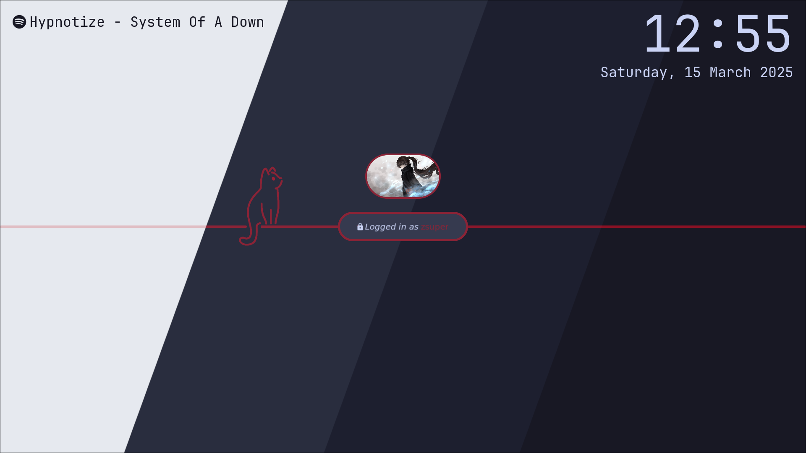
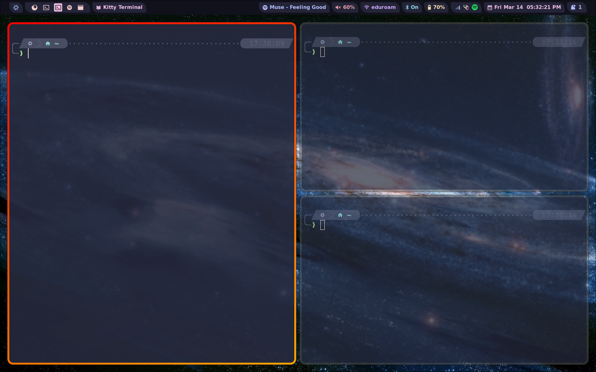
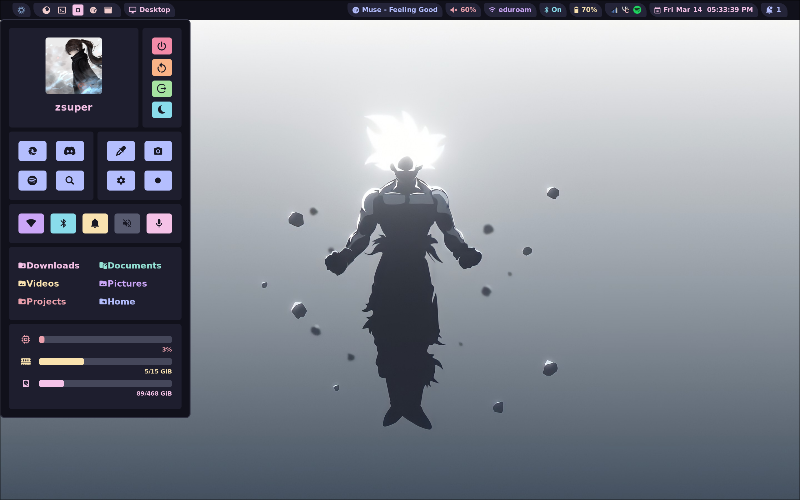

# Dotfiles

This repository contains the dot and nix files that build into my system. Instructions on how to reproduce and credits are below.

I'm pretty new to both Nix and the idea of dotfiles, so if you have any suggestions, feel free to let me know!





## Directory Structure

The `home-manager` and `system` directories contain `.nix` files for building my system. Note that `hardware-configuration.nix` is automatically generated by your system if using NixOS.

## Building

Both the system and home-manager configurations are built and managed through Nix Flakes.

To build, first clone the repo:
```
git clone git@github.com:piyushkumbhare/dotfiles.git
```

### System

Granted you have flake support enabled in NixOS, you can just run the standard rebuild command but with the flake argument:
```
sudo nixos-rebuild switch --flake ./dotfiles/system
```

### Home Manager

To build the home-manager configuration, first make sure you have [home-manager](https://nix-community.github.io/home-manager/index.xhtml#sec-flakes-standalone) installed and enabled. Then it's as simple as running:
```
home-manager switch --flake ./dotfiles/home-manager
```

## Credits

I am not a creative person lol. Here are the links I took some configs or inspiration from:

- [wofi](https://github.com/7KIR7/dots/tree/main)
- [hyprpanel](https://github.com/Jas-SinghFSU/HyprPanel)
- [hyprlock](https://github.com/catppuccin/hyprlock)
