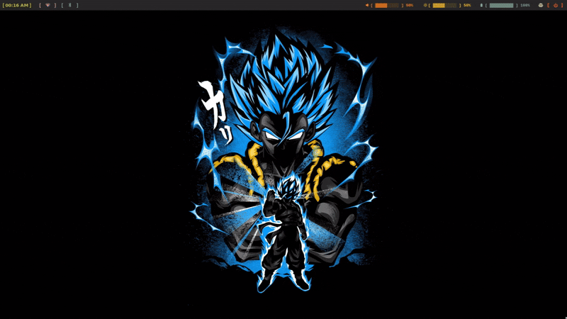

# Dotfiles

This repository contains all scripts, config, and most importantly, `.nix`
files that directly rebuild into my system.

## Previews

  
Hyprland

  ### Hyprland:
  

  ### Hyprlock:
  

  ### Hyprpanel:
  

  
Niri

  ### Niri:
  

  
Applications

  ### Rofi:
  

  ### Waybar:
  

  ### Yazi:
  

  ### Neovim + Tmux:
  

  ### Gotop:
  

## NixOS Configuration

Read [here](./SYSTEM.md)

## Exposed Packages

Read [here](./PACKAGES.md)

## Credits

Here are the slightly lesser known sources I referenced or drew inspiration
from in the past:

- [Unify](https://codeberg.org/quasigod/unify)
- [`import-tree`](https://github.com/vic/import-tree)
- [Nix Dendritic Pattern](https://github.com/mightyiam/dendritic)
- [Wofi config](https://github.com/7KIR7/dots/tree/main)
- [Hyprpanel](https://github.com/Jas-SinghFSU/HyprPanel)
- [Hyprlock config](https://github.com/catppuccin/hyprlock)
